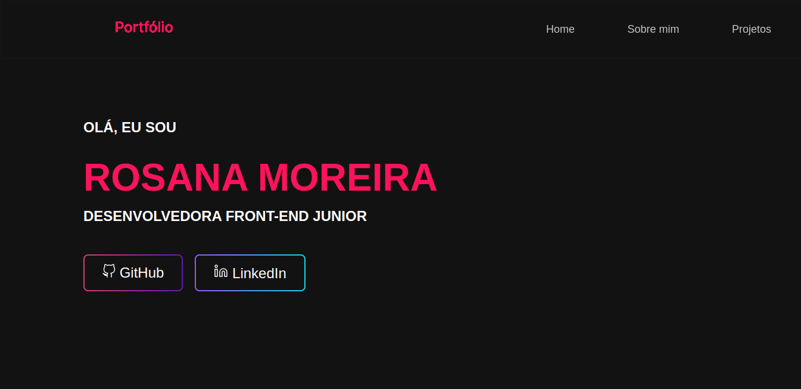
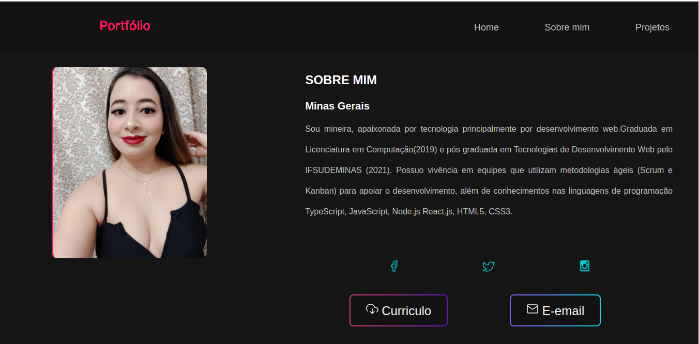
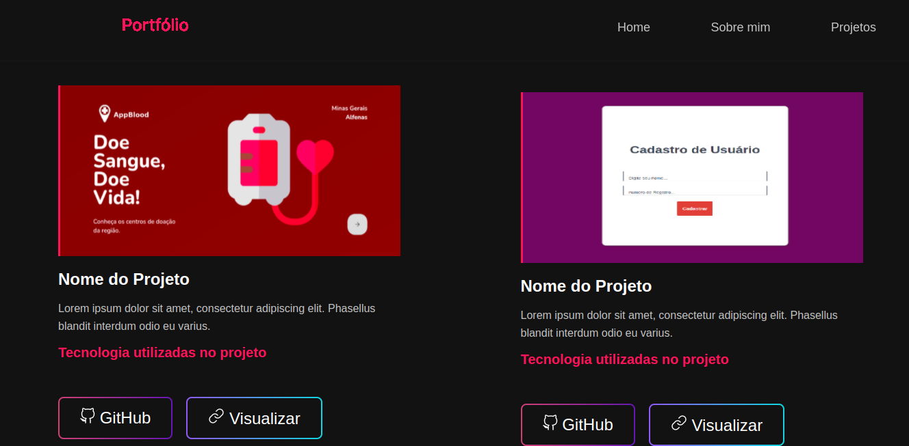

# Portifólio
# Descrição do Projeto
<p align="center">
Pagina em desenvolvimento.
</p>

<h1 align="center">
  
</h1>

<h1 align="center">
  
</h1>

<h1 align="center">
  
</h1>

### 🎲 Executando o codigo fonte

```bash
# Clone este repositório
$ git clone <https://github.com/rosana-moreira/Portifolio.git/>

# Acesse a pasta do projeto no terminal/cmd
$ cd Portifolio

# Abra o arquivo index.html pelo o navegador
$ index.html

```